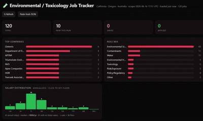

# 🧪 Job Scraper + Triage Dashboard

GitHub Actions pipelines that scrape job boards (LinkedIn, Indeed, USAJOBS, NEOGOV, CalOpps, CalCareers) on a schedule, commit the results to the repo, and surface them in a single filterable [`triage.html`](#interactive-triage-dashboard--triagehtml) dashboard hosted **free** on GitHub Pages — with a map, salary harmonization, cross-source de-duplication, save/applied/dismiss triage, and optional phone notifications. **No server, no paid services, and no API keys required.**

**Everything you search for lives in one file: [`config.json`](config.json)** — point it at your field and locations (or generate it from your CV with an LLM) and you have your own tracker. Live example: [scottcoff.in/Job_Scraper/triage.html](https://scottcoff.in/Job_Scraper/triage.html).



> This repo ships configured for **environmental / toxicology** roles (Dr. Scott Coffin's field — [scottcoff.in](https://scottcoff.in)) as a worked example, and began as [Ernesto Diaz](https://github.com/ernestod1998)'s Bay Area ML-engineer scraper. The walkthrough below sets up your own copy from scratch.

------------------------------------------------------------------------

# Set up your own (full walkthrough) 🚀

You only need a free [**GitHub account**](https://github.com/signup). Everything runs on GitHub's servers (Actions + Pages) — **you don't have to install anything or keep a computer on.** (Local install is optional; see [Running locally](#running-locally).)

## Step 1 — Get your own copy of the repo

### Option A — Fork ✅ recommended

Click **Fork** at the top of this page. You get a linked copy with GitHub's built-in **Sync fork** button — one click whenever this repo gets new scrapers, bug fixes, or dashboard features.

Your personal config (`config.json`, `scoring_profile.json`) and all scraped data (`output/`) are gitignored in this upstream repo, so syncing will **never** overwrite your customizations.

> Can't fork because you already own this repo? Use Option C.


### Option B — Import (for same-account users or CLI preference)

Use this when GitHub blocks forking because you already own the repo, or when you prefer the command line.

1. Go to **[github.com/new/import](https://github.com/new/import)**
2. Paste `https://github.com/ScottCoffin/Job_Scraper` as the clone URL
3. Name your repo and click **Begin import**
4. Clone it, then commit your config:

   ```bash
   git clone https://github.com/YOUR-USERNAME/YOUR-REPO.git
   cd YOUR-REPO
   cp config.example.json config.json
   cp scoring_profile.example.json scoring_profile.json
   # edit both files, then:
   git add -f config.json scoring_profile.json
   git commit -m "chore: personal config"
   git push
   ```

   > `config.json` and `scoring_profile.json` are gitignored upstream (so upstream never overwrites them), which is why `-f` is required.

---

### Staying up to date (Options B and C)

Forks (Option A) get GitHub's native Sync fork button. For B, pull improvements manually any time:

```bash
git remote add upstream https://github.com/ScottCoffin/Job_Scraper.git  # one-time setup
git fetch upstream && git merge upstream/main
```

Or let it run automatically: enable the **`sync_upstream.yml`** workflow in your repo (**Actions → Sync from upstream → Enable workflow**) and it merges new code every Monday.

> Always pull from `https://github.com/ScottCoffin/Job_Scraper` — never from someone else's personal fork.

<details>
<summary>Clone an existing copy to your computer</summary>

``` bash
git clone https://github.com/YOUR-USERNAME/YOUR-REPO.git
cd YOUR-REPO
```

You don't need to clone just to configure it — you can edit `config.json` directly on github.com.

</details>

## Step 2 — Set what you search for (`config.json`)

This is the only file you need to change. Pick one:

**First:** rename [`config.example.json`](config.example.json) to `config.json` in your repo (on GitHub: open the file → pencil → change filename at top → paste your edits → commit). If you used Option B above, you already did this locally.

**A. Generate it from your CV (no coding).** Open [`docs/cv-to-config-prompt.md`](docs/cv-to-config-prompt.md), copy the prompt, and paste it into [**ChatGPT**](https://chat.openai.com), [**Claude**](https://claude.ai), or any chatbot together with your CV and your target locations. It returns a finished `config.json` ready to commit.

**B. Edit by hand.** `config.example.json` is fully self-documenting. The two things almost everyone change: `keywords.include` + `search_terms` (what roles) and `locations` (where; LinkedIn `geoId` can be left `""`).

Optional knobs: `profile` (dashboard title/subtitle), `keywords.exclude`, `employers.priority` / `employers.exclude`, `priority_topics` (⭐ highlights), `role_categories` (the Role-filter buckets).

## Step 3 — Host the dashboard (GitHub Pages)

This publishes `triage.html` at a free public URL.
1. In your repo: **Settings → Pages**.
2. Under **Build and deployment → Source**, choose **Deploy from a branch**.
3. Branch: **`main`**, folder: **`/ (root)`** → **Save**.
4. After \~1 minute your dashboard is live at: **`https://YOUR-USERNAME.github.io/YOUR-REPO/triage.html`**

New to Pages? GitHub's 2-minute guide: [Creating a GitHub Pages site](https://docs.github.com/en/pages/getting-started-with-github-pages/creating-a-github-pages-site).
Want it on a custom domain (like `you.com/jobs`)? See [Managing a custom domain](https://docs.github.com/en/pages/configuring-a-custom-domain-for-your-github-pages-site).

## Step 4 — Turn on the scrapers (GitHub Actions)

1. Open the **Actions** tab → click **"I understand my workflows, enable them."**
2. **Settings → Actions → General → Workflow permissions** → select **Read and write permissions** → **Save**.
3. **Settings → Secrets and variables → Actions → Variables tab** → add a new variable:

   | Variable | Value |
   |----------|-------|
   | `ENABLE_DATA_COMMITS` | `true` |

   This tells CI to commit scraped results back to your repo. Without it, scrapers run but nothing is saved. The upstream template repo deliberately leaves this unset so its CI never commits data that would conflict with your copy when you sync.

## Step 5 — Run it the first time

In the **Actions** tab, open each watcher and click **Run workflow** (afterwards they run automatically on a schedule): - **LinkedIn** and **Indeed** watchers (work anywhere). - **USAJOBS** (US federal). **NEOGOV** / **CalOpps** / **CalCareers** are US / California public-sector boards — run them only if relevant, or [disable them](#turning-sources-on--off).

Give it 1–2 minutes, then open your `…/triage.html` URL. 🎉 Hard-refresh (ctrl+R) after each scrape to see new jobs.

## Step 6 — Phone notifications (optional)

Get a push the moment a relevant new role appears, via [**Pushover**](https://pushover.net) (a simple, one-time \~\$5 app for [iOS](https://apps.apple.com/us/app/pushover-notifications/id506088175) / [Android](https://play.google.com/store/apps/details?id=net.superblock.pushover); the API is free):
1. Sign in at [pushover.net](https://pushover.net), **Create an Application/API Token** (any name) → copy the **API Token**. Copy your **User Key** from the dashboard home.
2. In your repo: **Settings → Secrets and variables → Actions → New repository secret** — add `PUSHOVER_TOKEN` and `PUSHOVER_USER`.
3. Test it: **Actions → Test Pushover Notification → Run workflow** — you should get a push within \~20 seconds.
4. (Optional) Add a repository **Variable** `NOTIFY_MIN_FIT` to tune instant high-fit pings.
5. (Optional) Add repository **Variable** `WEEKLY_DIGEST_PUSHOVER=true` to receive the weekly Pushover brief. You can also set `WEEKLY_DIGEST_DAYS` (default `7`).

Without these secrets, notifications are simply off and everything else works.

## Step 7 — AI résumé fit-scoring (optional, advanced)

`triage_agent.py` can score each role against your résumé with the [**Claude API**](https://www.anthropic.com/api) (paid, \~pennies/run). It needs an `ANTHROPIC_API_KEY` secret plus your profile/résumé in secrets. Entirely optional — leave the `triage.yml` / `evals.yml` workflows **disabled** if you don't use it (**Actions → workflow → ⋯ → Disable**).

### Turning sources on / off

Each source is a workflow in [`.github/workflows/`](.github/workflows). To stop one, **Actions → that workflow → ⋯ → Disable workflow**. The dashboard simply skips any source file that doesn't exist, so nothing breaks.

### Running locally {#running-locally}

Optional — only if you want to test scrapes on your own machine. Needs [**Python 3.11+**](https://www.python.org/downloads/):

``` bash
python scrape_jobs.py --linkedin-only      # standard library only
python scrape_jobs.py --usajobs-only       # standard library only
pip install -r requirements.txt            # only Indeed needs this (python-jobspy)
python scrape_jobs.py --indeed-only
python -m http.server 8000                 # then open http://localhost:8000/triage.html
```

The dashboard must be served over HTTP (the commands above) — opening `triage.html` from `file://` won't load the data.

------------------------------------------------------------------------

> **The rest of this README documents how it works**, using the shipped environmental / toxicology example. Skim it to customize further; you don't need any of it to get running.

## What It Does

> The descriptions below use this repo's shipped example config (environmental / toxicology; California, Oregon & Australia). **Your locations, keywords, and employers come from [`config.json`](config.json)** — see the [walkthrough above](#set-up-your-own-full-walkthrough-).

### 1. Priority-employer digest — daily, last 24h

Hits LinkedIn's public guest endpoint for roles in your configured locations posted in the last 24 hours, then post-filters to a **priority-employer allowlist** (`employers.priority` in `config.json`). Treat the shipped employer list as an example only: replace it with the companies, agencies, universities, nonprofits, labs, hospitals, startups, studios, or other organizations that matter in your own field. Add to that list to expand coverage.

Output goes to `jobs.json`, `jobs.md`, and `jobs.html`. Each run dedupes against the previously-committed `jobs.json`, so the output surfaces only postings new since the last run.

> A direct-ATS probe path (`CURATED_BIOTECHS`) also exists but is **empty by default** in the shipped example. It is useful only when your target employers expose job data through supported public ATS endpoints. The LinkedIn + Indeed keyword watchers (which need no employer slug) are the primary sources for most users.

### 2. LinkedIn watcher — hourly, last 1h

Hits LinkedIn's public guest endpoint for roles in your configured locations posted in the last hour across your `search_terms`, dedupes by job ID, and sorts by recency. Output goes to `linkedin_jobs.json`, `linkedin_jobs.md`, and `linkedin_jobs.html`.

Runs hourly at :17 PT (8am–8pm) via native GitHub cron, with the in-repo watchdog (`linkedin_watch_backup.yml` at :33) re-dispatching missed slots. A block guard preserves the previous results when LinkedIn returns zero cards across every term (rate-limited run).

> ⚠️ Uses the unauthenticated public guest endpoint only — **never** signs in with a user account and does not use LinkedIn cookies, tokens, or credentials.

### 3. Indeed watcher — hourly, last 24h

Uses [`python-jobspy`](https://pypi.org/project/python-jobspy/) (Indeed's RSS and Publisher API were deprecated in 2026 and the site sits behind Cloudflare; JobSpy uses Indeed's mobile-app API internally). Searches your configured locations. Output goes to `indeed_jobs.json`, `indeed_jobs.md`, and `indeed_jobs.html`, deduped against the previous run. Runs at :47 PT, offset from LinkedIn's :17 slot.

## Keywords Matched

A title is included if it matches the include terms generated from [`config.json`](config.json). Multi-word phrases match as substrings; single tokens are word-bounded, so list full words. The shipped example uses environmental/toxicology terms like these; replace them with terms for your own domain:

**Domain/core role examples:** `toxicologist`, `software engineer`, `product manager`, `grant writer`, `clinical research coordinator`

**Methods or specialty examples:** `risk assess`, `machine learning`, `regulatory affairs`, `clinical trials`, `financial modeling`, `curriculum design`

**Tools, products, or regulated-area examples:** `R Shiny`, `Salesforce`, `Good Clinical Practice`, `NEPA`, `SAP`, `Kubernetes`, `Adobe Creative Suite`

**Topic examples:** `microplastic`, `PFAS`, `cybersecurity`, `housing policy`, `oncology`, `renewable energy`, `early childhood education`

**Seniority or work-style examples:** `senior`, `principal`, `director`, `remote`, `hybrid`, `field`, `research`, `policy`

The list is deliberately **tight** for precision: generic titles (`research scientist`, `senior scientist`, `data scientist`, `professor`, `regulatory affairs`) are usually too broad on their own. Pair broad words with your domain, method, tool, or organization context, for example `environmental data scientist`, `healthcare data scientist`, or `assistant professor of environmental health`.

**Excluded everywhere:** - **Junior / training:** `intern`, `internship`, `co-op`, `trainee`, `apprentice`, `technician`, `research/lab/teaching assistant`, `undergraduate`, `postdoc`, `work-study`, `volunteer`, `fellowship`. Keep or remove these based on the user's target career stage. - **Adjacent-but-wrong families:** add terms that are common false positives in your domain. In the shipped example, EHS/workplace-safety terms are excluded because they are adjacent to, but different from, the target environmental toxicology roles. In another domain this might be sales, customer support, bench research, finance, management-only roles, or another nearby category.

## Geographic Scope

**You define the locations** in [`config.json`](config.json) → `locations` (no code edits). The shipped example searches California, Portland & Bend OR, and Australia, but it works for anywhere — add/remove entries to suit:

-   **LinkedIn** — `locations.linkedin`: each is a `location` + LinkedIn `geoId`. Leave `geoId` blank to let LinkedIn resolve the text (works for most cities/metros), or fill in the numeric id for tighter filtering. A geoId reference table is in [`docs/cv-to-config-prompt.md`](docs/cv-to-config-prompt.md).
-   **Indeed** — `locations.indeed`: each is a `location` + `country` (`USA` → indeed.com, `Australia` → au.indeed.com, `GB`, `Canada`, …).
-   **USAJOBS** is nationwide US (federal); **NEOGOV** is filtered to your configured locations; **CalCareers** and **CalOpps** are California-only boards by nature (disable them if you're not searching California).
-   The map and dashboard auto-fit to wherever your jobs are.

## Output Files

| File | Source | Description |
|------------------------|------------------------|------------------------|
| `jobs.json` / `.md` / `.html` | Priority-employer digest | Allowlisted employer roles for your configured domain, last 24h, deduped against the previous run |
| `linkedin_jobs.json` / `.md` / `.html` | LinkedIn watcher | Roles in your configured locations, last 1h, deduped |
| `indeed_jobs.json` / `.md` / `.html` | Indeed watcher | Indeed-sourced roles in your locations, last 24h, deduped |
| `calcareers_jobs.json` / `.md` / `.html` | CalCareers watcher | California state civil-service roles (calcareers.ca.gov) |
| `usajobs_jobs.json` / `.md` / `.html` | USAJOBS watcher | US federal roles matching your configured keywords, with salary, via usajobs.gov |
| `governmentjobs_jobs.json` / `.md` / `.html` | NEOGOV watcher | State & local-gov roles matching your configured keywords via governmentjobs.com |
| `calopps_jobs.json` / `.md` / `.html` | CalOpps watcher | California local-agency roles (cities, counties, special districts) via calopps.org |
| `all_jobs.json` | accumulator | Cumulative 14-day master (feeds the dashboard + triage) |
| `scores.json` | triage agent | Optional fit verdicts keyed by job URL |

### CalCareers (California state jobs)

`scrape_jobs.py --calcareers-only` scrapes [calcareers.ca.gov](https://calcareers.ca.gov) — the CA state civil-service portal. This is useful when your configured role terms overlap with California state classifications. CalCareers is an ASP.NET WebForms site with **no public API**, so the scraper seeds a session and fires the search postback (`__EVENTTARGET=ctl00$cphMainContent$btnSearch` with the keyword field), then parses the labeled result cards. The working postback method was adapted from the [OpenPostings](https://github.com/Masterjx9/OpenPostings) `calcareers` module. Fully guarded; runs daily via `calcareers_watch.yml`. Verified against the shipped example configuration.

### USAJOBS (federal jobs)

`scrape_jobs.py --usajobs-only` scrapes [usajobs.gov](https://www.usajobs.gov) — US federal roles matching your configured keywords, **with salary**. It uses the site's public search endpoint (`/Search/ExecuteSearch`), so **no API key is required**: it seeds a session, then POSTs each keyword and keeps titles that pass your configured filter. Runs daily via `usajobs_watch.yml`. Federal roles are nationwide; use the dashboard's location filter/map to focus.

> Source identified from the [OpenPostings](https://github.com/Masterjx9/OpenPostings) project's catalog of 80+ ATS providers. OpenPostings is a self-hosted aggregator (not a hosted API), so rather than depend on it we query the official USAJOBS public endpoint directly.

### NEOGOV & CalOpps (state & local government)

Also added from the OpenPostings catalog — the boards that carry county/city roles LinkedIn and Indeed may miss:

-   **`--governmentjobs-only`** ([governmentjobs.com](https://www.governmentjobs.com) / NEOGOV) — state & local agencies nationwide; keyword-searched and filtered to your configured locations.
-   **`--calopps-only`** ([calopps.org](https://www.calopps.org)) — California local agencies (cities, counties, special & water districts). CA-only board, so it is title-filtered only.

Both are HTML scrapes (no API), fully guarded, and run daily via `localgov_watch.yml`. Local-government roles can be sparse, so yield is often low but high-signal when your target domain appears on public-sector boards.

### Dashboard features

The `triage.html` cockpit adds, on top of the source/role/seniority/date filters:

-   **★ Priority topics** — roles touching your configured signature topics get a gold ★ and a highlighted card; a toggle filters to just those. The shipped example uses microplastics, ecotoxicology, endocrine-disrupting chemicals, and R/Shiny. Edit `priority_topics` in `config.json` and the matching dashboard terms to change what's flagged.
-   **Cross-source de-dup** — the same role cross-posted to LinkedIn and Indeed collapses into one card (matched on title + location + compatible company), showing both source badges; triage applies to all copies at once.
-   **★ Best fit** view — ranks roles by match to the target user's specializations. The shipped example uses environmental/toxicology criteria, but you should replace those weights with criteria for your own domain. Weights live in `FIT_TERMS` in `triage.html`; every card shows a 0–100 fit chip.
-   **🚫 Not relevant** button — hides a role *and* learns from it: titles sharing distinctive words with your "not relevant" marks are down-ranked in Best fit.
-   **Salary slider** — harmonizes inconsistent pay formats (hourly, monthly, yearly, `$k` ranges, title-embedded) to an annual figure, then filters by a minimum, with an "include unlisted" toggle.
-   **🗺 Map** view — Leaflet map of roles by city (client-side geocoding, no API key) that auto-fits to wherever your jobs are; hover a dot for the location, click for the roles. Remote/unknown roles cluster at a default center.

### Interactive triage dashboard — `triage.html`

A single-file dashboard hosted on GitHub Pages that merges the latest source JSONs into one filterable cockpit: search; source / role / seniority filters (role buckets come from `config.json`); save / applied / dismiss buttons persisted in localStorage; top-companies and role-mix charts; and an "export saved as Claude prompt" action.

**View it (after enabling Pages — see Deployment):** `https://scottcoffin.github.io/Job_Scraper/triage.html`

The dashboard fetches the JSON files from the same repo at view time, so it always reflects the latest committed scrape. To run locally:

``` bash
python -m http.server 8000
# then visit http://localhost:8000/triage.html
```

Opening from `file://` won't work — the dashboard needs same-origin HTTP to `fetch()` the source JSONs.

## Reference: commands & options

### Run a source manually

From the **Actions** tab → *Run workflow* on any watcher, or locally:

``` bash
python scrape_jobs.py --biotech-only         # priority-employer digest (allowlist)
python scrape_jobs.py --linkedin-only        # general LinkedIn, last 1h
python scrape_jobs.py --indeed-only          # general Indeed, last 24h
python scrape_jobs.py --usajobs-only         # US federal jobs (usajobs.gov, no API key)
python scrape_jobs.py --governmentjobs-only  # state/local gov (NEOGOV)
python scrape_jobs.py --calopps-only         # California local agencies (calopps.org)
python scrape_jobs.py --calcareers-only      # California state jobs (calcareers.ca.gov)
```

The LinkedIn / priority / USAJOBS / gov pipelines use only the **Python standard library**. Only Indeed needs a dependency: `pip install -r requirements.txt` (single package, `python-jobspy`).

### 📲 Phone notifications (Pushover)

> Quick setup is in the [walkthrough Step 6](#step-6--phone-notifications-optional); this is the detail.

Get a push to your phone the moment a **highly-relevant** new role appears. After each scrape, `notify.py` pushes any new posting that either touches a priority topic from your configuration or scores ≥ `NOTIFY_MIN_FIT` (default 75) on the resume-fit model. It dedupes against `notified.json`, so the same role is never pushed twice (across sources or runs). Priority-topic hits ping at high priority. The shipped example's priority topics are environmental/toxicology-specific placeholders; replace them with the topics that signal an unusually good match in your domain.

To enable, add these in **Settings → Secrets and variables → Actions**:

| Secret | Value |
|------------------------------------|------------------------------------|
| `PUSHOVER_TOKEN` | Your Pushover **application/API token** (create an app at pushover.net) |
| `PUSHOVER_USER` | Your Pushover **user key** (top of your pushover.net dashboard) |

Optional **Variable** (not secret): `NOTIFY_MIN_FIT` — lower than 75 for more (less selective) pings, higher for fewer. Without the two secrets, notifications are simply off (everything else still works).

Weekly brief: the `Weekly Job Digest` workflow runs Monday morning and is off by default. To opt in, add repository **Variable** `WEEKLY_DIGEST_PUSHOVER=true`. The brief reads `all_jobs.json` for roles first seen in the last 7 days, groups them by salary band and organization, and includes a few standouts ranked by `scores.json` when the optional triage agent has run. If `scores.json` is absent, it falls back to the same deterministic resume-fit scorer used for instant Pushover alerts, so no LLM is required. Optional variables:

| Variable                 | Value                                       |
|--------------------------|---------------------------------------------|
| `WEEKLY_DIGEST_PUSHOVER` | `true` to enable the scheduled weekly brief |
| `WEEKLY_DIGEST_DAYS`     | Lookback window; default `7`                |
| `DASHBOARD_URL`          | Override the link attached to the push      |

#### Calibrating fallback fit scoring

The weekly digest does not need an LLM at send time. When `scores.json` is empty, it uses deterministic criteria in `notify.py` (`FIT_TERMS`, `SIGNATURE_TERMS`, and `POOR_FIT_TERMS`) to pick the closest matches. Calibrate those criteria from a real gold-standard duty statement before trusting the fallback. A gold-standard role is the kind of posting that should be treated as a perfect match for the target user and score `100`.

Beginner workflow:

1.  Collect examples. You do not need to read or paste code.
    -   1-3 perfect-fit job descriptions or duty statements that should score `100`.
    -   5-10 good-fit jobs that should score roughly `70-89`.
    -   10-20 false positives that should score below `25`.
    -   Your CV/resume, or a short profile of your target roles.
2.  Paste the "simple calibration prompt" below into your preferred LLM.
3.  In GitHub, create or edit a file named `scoring_profile.json` at the repo root.
4.  Paste the LLM's JSON output into that file and commit it.
5.  Run `python notify.py --weekly-digest --dry-run` or manually dispatch the weekly digest workflow and check whether the listed matches look right.

Simple calibration prompt:

``` text
You are helping calibrate job-fit scoring for a job scraper. I am a non-technical
user. Output only valid JSON that I can paste directly into a file named
scoring_profile.json. Do not include markdown fences, comments, prose, or
trailing commas.

Goal:
- A job matching the GOLD-STANDARD DUTY STATEMENT should score 100/100.
- A strong adjacent role should score 70-89.
- A plausible but generic adjacent role should score 35-59.
- A poor-fit role should score below 25 even if it contains broad words like
  <<<PASTE 5-10 BROAD DOMAIN WORDS THAT CREATE FALSE POSITIVES HERE>>>.

Candidate profile/CV:
<<<PASTE CV OR RESUME TEXT HERE>>>

Gold-standard 100/100 duty statement:
<<<PASTE DUTY STATEMENT TEXT HERE>>>

Gold-standard summary, if useful:
<<<PASTE A SHORT DESCRIPTION OF WHY THIS ROLE SHOULD SCORE 100, E.G. "This role
combines [domain], [methods/tools], [seniority], [organization type], and
[work products] that exactly match the target user.">>>

Optional negative examples:
<<<PASTE JOB TITLES/DESCRIPTIONS THAT SHOULD NOT BE STANDOUTS HERE>>>

Task:
1. Extract the exact positive scoring dimensions from the gold-standard duty
   statement. Separate must-have signals from nice-to-have signals.
2. Identify broad terms that create false positives and should not score highly
   by themselves.
3. Identify job families, industries, seniority levels, or task types that should
   be penalized.
4. Return JSON using exactly this shape:
{
  "version": 1,
  "description": "Short non-private description of this scoring profile.",
  "settings": {
    "title_multiplier": 3,
    "body_multiplier": 1,
    "score_multiplier": 1.6,
    "generic_cap": 35,
    "standout_threshold": 60
  },
  "fit_terms": [
    {"pattern": "specific positive phrase|another positive phrase", "weight": 12}
  ],
  "signature_terms": [
    "regex for evidence that this is truly candidate-specific"
  ],
  "poor_fit_terms": [
    {"pattern": "false positive phrase|wrong job family", "penalty": 35}
  ],
  "test_cases": [
    {
      "title": "Gold-standard role title",
      "company": "Example organization",
      "description": "Short excerpt or summary",
      "expected_score_range": [100, 100],
      "rationale": "Why this should score 100"
    }
  ]
}
5. Include the gold-standard role as a test case with expected score range [100, 100].
6. Use JSON strings for regex patterns. Escape backslashes as needed for valid
   JSON, for example "\\bword\\b".

Important calibration requirements:
- The gold-standard role must score exactly 100.
- Broad domain terms must not produce high scores by themselves. They should
  require pairing with candidate-specific evidence such as target methods,
  tools, subject matter, seniority, organization type, regulated domain,
  deliverables, or work products.
- Generic adjacent jobs, wrong-seniority jobs, wrong-industry jobs, and roles
  with misleading keyword overlap should be penalized unless the description
  contains strong candidate-specific evidence.
- If there are no roles above 60, the digest should label them as closest
  matches rather than standouts.

Output format:
- Output only the JSON object for scoring_profile.json.
- Do not include private CV details in public-facing fields such as description
  or rationale.
```

**Test it** (sends one push to your phone): - **From GitHub (recommended):** Actions → **Test Pushover Notification** → *Run workflow*. Uses your Actions secrets, so it confirms the real setup. The run log prints whether the keys are set and the exact Pushover API response on failure (e.g. a bad token/user key). - **Weekly digest dry run:** `python notify.py --weekly-digest --dry-run` - **Locally:** `bash   PUSHOVER_TOKEN=xxx PUSHOVER_USER=yyy python notify.py --test`

### Optional: nightly fit-scoring agent (`triage.yml`)

`triage_agent.py` scores each new role against your profile with the Claude API. It is **optional** and needs three repo secrets (**Settings → Secrets and variables → Actions**):

| Secret | Value |
|------------------------------------|------------------------------------|
| `ANTHROPIC_API_KEY` | Anthropic API key |
| `CANDIDATE_PROFILE` | Short profile text (your background/targets — kept out of the public repo) |
| `CANDIDATE_RESUME` | Resume / CV text (kept out of the public repo) |

Paste your CV text into `CANDIDATE_RESUME`. Without these secrets, leave `triage.yml` and `evals.yml` disabled (Actions → ⋯ → Disable workflow) — the scrapers and dashboard work fully without them; `scores.json` is optional.

> Note: `eval_triage.py` still contains the original ML-candidate golden cases. They only matter if you run the triage agent; rewrite them for your domain (or keep `evals.yml` disabled) once you've finalized your profile.

## Repo Structure

```
├── config.example.json             # ⭐ Template config — copy to config.json and edit
├── scoring_profile.example.json    # Template scoring profile — copy to scoring_profile.json
├── config.json                     # YOUR settings (gitignored; not committed upstream)
├── scoring_profile.json            # YOUR scoring weights (gitignored; not committed upstream)
├── triage.html                     # Interactive dashboard (served by GitHub Pages)
├── scrape_jobs.py                  # All scraping logic (reads config.json)
├── notify.py                       # Pushover notifications (optional)
├── triage_agent.py                 # Optional nightly fit-scoring agent (Claude API)
├── eval_triage.py                  # Golden-case evals for the triage agent
├── requirements.txt                # python-jobspy (Indeed only)
├── output/                         # Scraped data — gitignored upstream, populated by your CI
│   ├── jobs.{json,md,html}         # Priority-employer digest (last 24h)
│   ├── linkedin_jobs.{json,md,html}
│   ├── indeed_jobs.{json,md,html}
│   ├── calcareers_jobs.{json,md,html}
│   ├── usajobs_jobs.{json,md,html}
│   ├── governmentjobs_jobs.{json,md,html}
│   ├── calopps_jobs.{json,md,html}
│   ├── all_jobs.json               # Cumulative 14-day master (feeds dashboard + triage)
│   ├── scores.json                 # Triage verdicts (optional)
│   ├── notified.json               # Push-notification dedup log
│   └── workflow_runs.jsonl         # CI run audit log
├── docs/
│   ├── cv-to-config-prompt.md      # LLM prompt to generate config.json from a CV
│   └── triage.gif                  # Dashboard demo
└── .github/workflows/
    ├── scrape_jobs.yml             # Daily — priority-employer digest
    ├── linkedin_watch.yml          # Hourly :17 PT — general LinkedIn (last 1h)
    ├── indeed_watch.yml            # Hourly :47 PT — Indeed (last 24h)
    ├── calcareers_watch.yml        # Daily — CalCareers (California state jobs)
    ├── usajobs_watch.yml           # Daily — USAJOBS (federal jobs, no API key)
    ├── localgov_watch.yml          # Daily — NEOGOV + CalOpps (state & local gov)
    ├── linkedin_watch_backup.yml   # Watchdog :33 PT — re-dispatches missed runs
    ├── weekly_digest.yml           # Weekly — optional Pushover summary brief
    ├── triage.yml                  # Nightly — optional fit scoring (needs secrets)
    ├── evals.yml                   # Triage-agent evals (optional)
    └── sync_upstream.yml           # Weekly — auto-merge code updates from upstream
```

## Tuning the search

Everything you'd adjust lives in [**`config.json`**](config.json) (no code edits) — the scraper and dashboard both read it: - `keywords.include` — title-match terms · `keywords.exclude` — titles to drop. - `search_terms.linkedin` / `search_terms.indeed` — queries sent to the boards. - `locations.linkedin` (with `geoId`) / `locations.indeed` (with `country`). - `employers.priority` (allowlist for the digest) / `employers.exclude` (drop). - `priority_topics` (⭐ highlights) · `role_categories` (Role-filter buckets) · `profile` (dashboard + digest branding).

Generate the whole file from your CV with [`docs/cv-to-config-prompt.md`](docs/cv-to-config-prompt.md), or edit it by hand (every key is commented).
